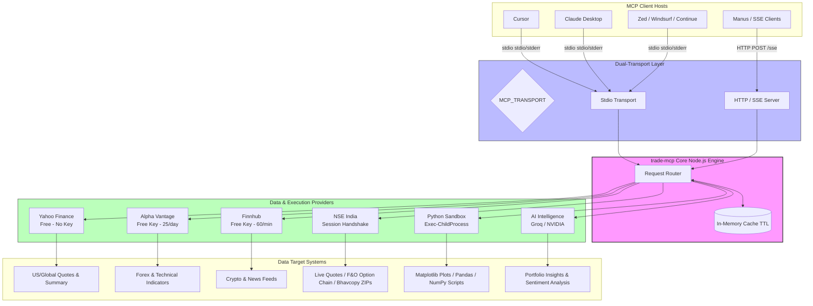

# 📈 trade-mcp — Advanced Stock Market MCP Server

[](https://nodejs.org/)
[](https://opensource.org/licenses/MIT)
[](#🔌-host-configurations)

An elite, high-performance [Model Context Protocol (MCP)](https://modelcontextprotocol.io) server providing real-time worldwide stock market data (including extensive **US & Indian markets**), technical indicators, historical data, company financials, news feeds, and native **Python data-science sandboxing** alongside **Groq/NVIDIA AI models**.

---

## 🏗️ System Architecture

`trade-mcp` acts as a unified bridge between your favorite AI hosts and multiple free market data sources, running on a dual-transport layer.



---

## ⚡ Quick Start

### Step 1 — Clone & Install Dependencies
First, make sure you have **Node.js >= 20** and **Python >= 3** installed.
```bash
git clone https://github.com/Techie03/trade-mcp.git
cd trade-mcp
npm install
```

### Step 2 — Configure Environment Variables
Copy `.env.example` to `.env`:
```bash
copy .env.example .env
```
Open the `.env` file and insert your API keys:
```env
# ── Market Data (all free) ──────────────────────
ALPHA_VANTAGE_KEY=your_alpha_vantage_key
FINNHUB_KEY=your_finnhub_key

# ── AI Intelligence (all free) ──────────────────
GROQ_API_KEY=your_groq_api_key
NVIDIA_API_KEY=your_nvidia_api_key

# ── Transport (stdio is default for local hosts)
MCP_TRANSPORT=stdio
PORT=3000
```

### Step 3 — Compile the Server
Build the TypeScript files into compiled JavaScript:
```bash
npm run build
```

---

## 🔌 Host Configurations

Configure the server in your favorite editor/client.

### ⚡ Direct Remote SSE Connection (No Installation Required)

You can connect directly to the active remote server instance **`https://nishith374-stock-mcp.hf.space/sse`** immediately without cloning the code or compiling it locally!

#### 1. Codex / Cursor (Via Settings UI)
1. Navigate to **Cursor Settings** → **Models** → **MCP**.
2. Click **+ Add New MCP Server**.
3. Enter Name: `trade-mcp`
4. Choose Type: **`Streamable HTTP`**
5. Paste URL: `https://nishith374-stock-mcp.hf.space/sse`
6. Click **Save**.


#### 2. Cursor (Via Config JSON)
Update your global `mcp.json` file (typically in `%APPDATA%\Cursor\User\mcp.json` or `~/.config/Cursor/User/mcp.json`):
```json
{
  "mcpServers": {
    "trade-mcp": {
      "url": "https://nishith374-stock-mcp.hf.space/sse"
    }
  }
}
```

#### 3. Claude.ai (Via Custom Connectors UI)
1. Open your Claude.ai account settings → **Connectors**.
2. Click **Add custom connector**.
3. Enter Name: `trade-mcp`
4. Enter URL: `https://nishith374-stock-mcp.hf.space/sse`
5. Click **Add**.


#### 4. Claude Desktop (Config JSON)
Update your `claude_desktop_config.json` file:
```json
{
  "mcpServers": {
    "trade-mcp-remote": {
      "command": "npx",
      "args": [
        "-y",
        "mcp-remote",
        "https://nishith374-stock-mcp.hf.space/sse"
      ]
    }
  }
}
```

---

### 💻 Local Installation & Config

If you choose to clone, compile, and run the server locally on your machine:

#### 1. Cursor (Local)
Copy the configuration block to your **global Cursor configuration file**:
- **Windows**: `%APPDATA%\Cursor\User\mcp.json`
- **macOS/Linux**: `~/.config/Cursor/User/mcp.json`

```json
{
  "mcpServers": {
    "trade-mcp": {
      "command": "node",
      "args": ["C:/Users/nishi/Desktop/trade-mcp/dist/index.js"],
      "env": {
        "ALPHA_VANTAGE_KEY": "your_alpha_vantage_key",
        "FINNHUB_KEY": "your_finnhub_key",
        "GROQ_API_KEY": "your_groq_api_key",
        "NVIDIA_API_KEY": "your_nvidia_api_key"
      }
    }
  }
}
```
*(Note: Replace the absolute path `"C:/Users/nishi/Desktop/trade-mcp/dist/index.js"` with the actual folder path on your system, using forward slashes `/`.)*

### 2. Claude Desktop
Add to your Claude Desktop config file:
- **Windows**: `%APPDATA%\Claude\claude_desktop_config.json`
- **macOS**: `~/Library/Application Support/Claude/claude_desktop_config.json`

```json
{
  "mcpServers": {
    "trade-mcp": {
      "command": "node",
      "args": ["C:/Users/nishi/Desktop/trade-mcp/dist/index.js"],
      "env": {
        "ALPHA_VANTAGE_KEY": "your_alpha_vantage_key",
        "FINNHUB_KEY": "your_finnhub_key",
        "GROQ_API_KEY": "your_groq_api_key",
        "NVIDIA_API_KEY": "your_nvidia_api_key"
      }
    }
  }
}
```

### 3. Zed Editor
Add to `~/.config/zed/settings.json`:
```json
{
  "context_servers": {
    "trade-mcp": {
      "command": {
        "path": "node",
        "args": ["C:/Users/nishi/Desktop/trade-mcp/dist/index.js"],
        "env": {
          "ALPHA_VANTAGE_KEY": "your_alpha_vantage_key",
          "FINNHUB_KEY": "your_finnhub_key",
          "GROQ_API_KEY": "your_groq_api_key",
          "NVIDIA_API_KEY": "your_nvidia_api_key"
        }
      }
    }
  }
}
```

### 4. Continue.dev
Merge the following into `~/.continue/config.json`:
```json
{
  "experimental": {
    "modelContextProtocolServers": [
      {
        "transport": {
          "type": "stdio",
          "command": "node",
          "args": ["C:/Users/nishi/Desktop/trade-mcp/dist/index.js"],
          "env": {
            "ALPHA_VANTAGE_KEY": "your_alpha_vantage_key",
            "FINNHUB_KEY": "your_finnhub_key",
            "GROQ_API_KEY": "your_groq_api_key",
            "NVIDIA_API_KEY": "your_nvidia_api_key"
          }
        }
      }
    ]
  }
}
```

---

## 🛠️ Complete Tools Reference (28 Tools)

### 📈 Market Data (4)
| Tool Name | Key Parameters | Description |
|---|---|---|
| `get_quote` | `symbol` (e.g. AAPL, TCS.NS) | Returns real-time equity quotes with high/low/close and volume metrics. |
| `get_historical` | `symbol`, `range`, `interval` | Returns OHLCV historical time series (1d to 10y ranges). |
| `get_market_summary` | None | Returns quick global indices scoreboard (S&P500, NIFTY50, Nasdaq, FTSE). |
| `search_symbol` | `query` (e.g. Reliance) | Fuzzy search for stocks across worldwide exchanges. |

### 🏢 Fundamentals (3)
| Tool Name | Key Parameters | Description |
|---|---|---|
| `get_company_overview` | `symbol` (e.g. MSFT) | Detailed capital metrics (Beta, P/E, EPS, Profit Margins, Sector). |
| `get_financials` | `symbol`, `period` | Pulls balance sheet, cash flows, and income statement. |
| `get_earnings` | `symbol` | Earnings history, consensus estimates, and surprise metrics. |

### 📰 News Feeds (2)
| Tool Name | Key Parameters | Description |
|---|---|---|
| `get_news` | `symbol`, `days` | Pulls recent market and corporate news articles for a specific stock. |
| `get_market_news` | `category` (general, tech, etc) | Global general financial news stream. |

### 📊 Technical Indicators (2)
| Tool Name | Parameters | Description |
|---|---|---|
| `get_technical_indicators` | `symbol`, `indicator` | SMA, EMA, RSI, MACD, Bollinger Bands, VWAP, ADX indicators. |
| `get_sector_performance` | None | Real-time performance breakdown of standard US market sectors. |

### 🇮🇳 India-Specific (6)
| Tool Name | Parameters | Description |
|---|---|---|
| `get_nse_quote` | `symbol` (e.g. RELIANCE) | Official quote with VWAP, circuit filters, delivery quantities, and margins. |
| `get_nse_indices` | None | Real-time index tracker for Nifty50, Banknifty, Midcap, VIX, etc. |
| `get_nse_option_chain` | `symbol` | Live derivatives option chain (Call/Put Open Interest, strike prices). |
| `get_nse_historical` | `symbol`, `date` (YYYYMMDD) | Unzips and extracts EOD historical Bhavcopy for any listed stock. |
| `get_nse_corporate_actions`| `symbol` | Board meetings, dividends, splits, announcements. |
| `get_bse_quote` | `symbol` (e.g. 500325) | Pulls delayed Bombay Stock Exchange pricing. |

### 💱 Forex & Crypto (2)
| Tool Name | Parameters | Description |
|---|---|---|
| `get_forex` | `from_currency`, `to_currency` | Real-time conversion rates (e.g., USD to INR, EUR to USD). |
| `get_crypto_quote` | `symbol` (e.g. BTC, ETH) | Captures USD coin quotes using exchange socket data. |

### 🤖 AI Market Intelligence (8)
| Tool Name | Description | Engine |
|---|---|---|
| `analyze_sentiment` | Bullish/Bearish/Neutral score with confidence. | Groq LLaMA 3.3 -> NVIDIA NIM |
| `get_stock_insight` | Deep dashboard: metrics, technicals, news, and rating. | Groq LLaMA 3.3 -> NVIDIA NIM |
| `summarize_news` | Summarizes recent news articles into a concise brief. | Groq LLaMA 3.3 -> NVIDIA NIM |
| `analyze_earnings` | Analyses EPS surprises, revenue growth, and guidance. | Groq LLaMA 3.3 -> NVIDIA NIM |
| `compare_stocks` | Side-by-side comparison of 2-5 tickers with verdict. | Groq LLaMA 3.3 -> NVIDIA NIM |
| `get_trade_signal` | Generates a buy/sell rating based on RSI & moving averages. | Groq LLaMA 3.3 -> NVIDIA NIM |
| `analyze_portfolio` | Analyzes portfolio diversification, risk, and sectors. | Groq LLaMA 3.3 -> NVIDIA NIM |
| `explain_indicator` | Explains technical outputs in plain language. | Groq LLaMA 3.3 -> NVIDIA NIM |

### 🐍 Python Data-Science Sandbox (1)
| Tool Name | Parameters | Description |
|---|---|---|
| `run_python_analysis` | `code` (Python string) | Runs dynamic analysis code in the `analysis/` folder. Supports `pandas`, `numpy`, and `matplotlib` to write files and output complex math or saved charts. |

### 🔍 Web Search (1)
| Tool Name | Parameters | Description |
|---|---|---|
| `search_web` | `query`, `max_results` (int, default: 5) | Performs a real-time financial or general web search using the Tavily API, returning concise text snippets optimized for LLM context. |

---

## 📊 Live Verification Results

The server contains an automated verification suite verifying all primary functions:
```bash
node --env-file=.env test.mjs
```

### Passing Output:
```text
╔══════════════════════════════════════════════════════════╗
║           trade-mcp  —  Live API Test Results           ║
╠══════════════════════════════════════════════════════════╣
║ ✅ PASS  Yahoo Finance (RELIANCE.NS)                     ║
║      ₹1263 | 0.33% | NSI                                 ║
╠══════════════════════════════════════════════════════════╣
║ ✅ PASS  Yahoo Finance (AAPL)                            ║
║      $295.63 | 1.39%                                     ║
╠══════════════════════════════════════════════════════════╣
║ ✅ PASS  Finnhub News (TCS)                              ║
║      0 articles returned                                 ║
╠══════════════════════════════════════════════════════════╣
║ ✅ PASS  Alpha Vantage (AAPL overview)                   ║
║      P/E: 35.83 | Sector: TECHNOLOGY                     ║
╠══════════════════════════════════════════════════════════╣
║ ✅ PASS  NSE Bhavcopy (CSV/ZIP)                          ║
║      RELIANCE close ₹1258.8 | 2660 stocks                ║
╠══════════════════════════════════════════════════════════╣
║ ✅ PASS  Groq AI (LLaMA 3.3)                             ║
║      Bullish | score:80 | Groq                           ║
╠══════════════════════════════════════════════════════════╣
║ ✅ PASS  Python Execution (run_python)                   ║
║      Pandas loaded & executed | stdout: MEAN: 2.0        ║
╠══════════════════════════════════════════════════════════╣
║  Result: 7/7 tests passed                                ║
╚══════════════════════════════════════════════════════════╝
```

---

## 🌐 Remote Deployment

To connect remote hosts (like Manus or other cloud agents), you can deploy the Docker container to a cloud provider:

### Cloud Hosting (Hugging Face Spaces, Koyeb, Render, etc.)
This repository is equipped with a production-ready `Dockerfile` listening on port `7860`.
1. Fork or push this repository to GitHub or Hugging Face.
2. Setup a Docker-based app/Space.
3. Configure your API keys (`ALPHA_VANTAGE_KEY`, `FINNHUB_KEY`, `GROQ_API_KEY`, `NVIDIA_API_KEY`, `TAVILY_API_KEY`) securely as environment variables/secrets.
4. Get your public HTTPS server endpoint (e.g. `https://your-app.hf.space/sse`).

---

## 🛡️ Rate Limits & Cache
To prevent rate-limit bans on free keys:
- **Yahoo Finance**: Public endpoint uses browser headers & session rotation.
- **NSE India**: Custom 2-step handshake (initializes session cookie by visiting homepage, then requests endpoint).
- **Alpha Vantage**: Auto-stops fetching and switches to caches once the 25 req/day limit is hit.
- **Finnhub**: Hard rate checking (resets every minute).
- **Groq**: LLaMA 3.3 fallback to NVIDIA NIM when hits `429 Too Many Requests`.

---

## 📜 Disclaimer & License

*Disclaimer: This server is meant strictly for educational and informational purposes. None of the data or responses produced constitute financial advice.*

Licensed under the [MIT License](LICENSE).
